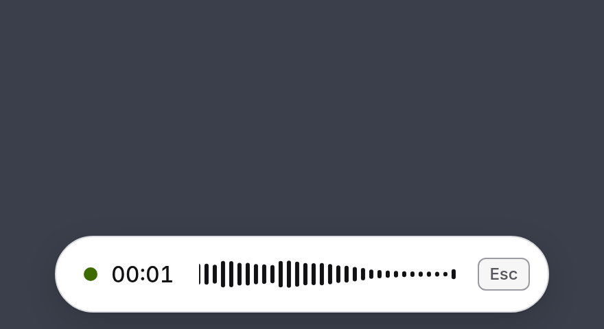
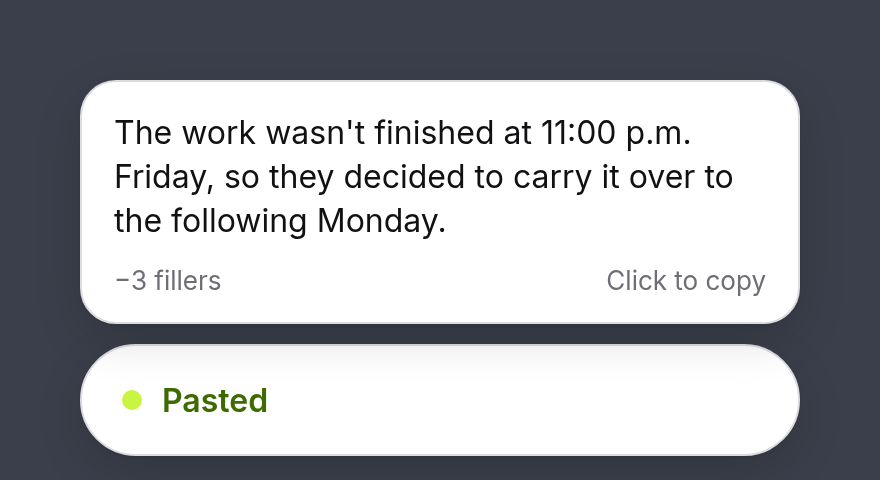
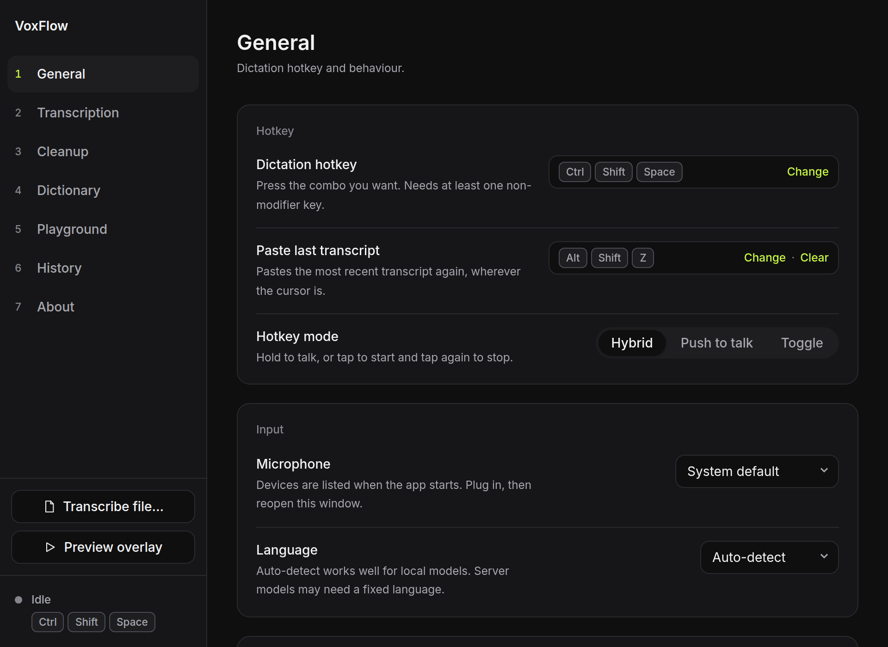

# VoxFlow

A homemade alternative for people not paying $20/month for an LLM-assisted transcription wrapper.

Press a hotkey anywhere, speak, and the transcript is pasted into the focused window. Transcription runs locally (whisper.cpp) or via any OpenAI-compatible API. Windows first; X11 Linux second.

<p align="center">
  
  
</p>



## Download

Grab `voxflow.exe` from the latest [windows workflow](.github/workflows/windows.yml) run or a [release](../../releases). Binaries are unsigned, so SmartScreen may warn.

## Features

- **Global hotkey** (Ctrl+Shift+Space): hold for push-to-talk, tap for hands-free (auto-stops after 30s of silence); Esc cancels
- **Local or remote transcription**: whisper.cpp, or OpenAI / Groq / self-hosted faster-whisper
- **Cleanup** (off / basic / AI): strips filler words and fixes punctuation; AI mode works with any OpenAI-compatible endpoint (Ollama, LM Studio, OpenAI, Groq, OpenRouter, Anthropic) and falls back to basic on errors
- **Personal dictionary** and **custom AI instructions**
- **Auto-paste** with optional clipboard restore; **paste-last hotkey** (Alt+Shift+Z)
- **Pill overlay** with live waveform and transcript bubble
- **History** (last 200, searchable, raw + cleaned text)
- **API keys** stored in the OS keyring, never on disk

First run: download a model in Settings → Transcription (local), or add an API key (remote).

## Trying it without a microphone

- **Transcribe file…** (Settings): wav/mp3/m4a/ogg/flac, up to 10 minutes
- **Drag and drop**: drop an audio file on the window to transcribe it
- **Cleanup playground** (Settings): compare basic vs AI cleanup on pasted text

## Building

### Windows exe from WSL (recommended)

Uses [cargo-xwin](https://github.com/rust-cross/cargo-xwin); no sudo, nothing installed on Windows.

```bash
# One-time: LLVM 21 into ~/.local/xtool
mkdir -p ~/.local/xtool/debs && cd ~/.local/xtool/debs
apt-get download clang-21 lld-21 llvm-21 libclang-cpp21 libllvm21 llvm-21-linker-tools \
  libclang-common-21-dev libclang-rt-21-dev
for d in *.deb; do dpkg -x "$d" ~/.local/xtool; done
cd -
uv tool install ninja
cargo install --locked cargo-xwin
rustup target add x86_64-pc-windows-msvc
./scripts/bootstrap-sysroot.sh

# Build (optional arg copies the exe there)
./scripts/build-windows.sh /mnt/c/Users/<you>/Desktop
```

### Windows native

Needs the Rust MSVC toolchain, VS 2022 Build Tools (C++), CMake, LLVM with `LIBCLANG_PATH` set, and bun.

```bash
bun install && bun tauri build
```

### Linux (X11)

```bash
sudo apt install cmake clang libclang-dev libasound2-dev libwebkit2gtk-4.1-dev \
  libgtk-3-dev libayatana-appindicator3-dev librsvg2-dev
bun install && bun tauri build
```

No root? Run `./scripts/bootstrap-sysroot.sh && source scripts/linux-dev-env.sh` first.

### Options

- **GPU:** add `features = ["vulkan"]` to `whisper-rs` in `core/Cargo.toml` (needs the Vulkan SDK)
- **Remote-only:** set `default-features = false` on `voxflow-core` in `src-tauri/Cargo.toml`

## Development

```bash
bun run dev             # Browser preview with mock backend
bun test                # Frontend tests
cargo test --workspace  # Rust tests
```

The pill accepts `pill.html?state=recording|transcribing|cleaning|done|error` to freeze a state.

Layout: `src/` React UI, `src-tauri/` app shell (hotkey, tray, IPC), `core/` audio, transcription, persistence, paste.

Data lives under `com.voxflow.app` in the OS config/data dirs (`%APPDATA%` on Windows, `~/.config` + `~/.local/share` on Linux).

## Known limitations

- **Wayland:** no global hotkeys; paste may fail (falls back to clipboard)
- **Modifier-only hotkeys** (e.g. Ctrl+Win) aren't supported
